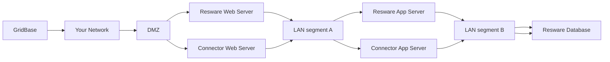
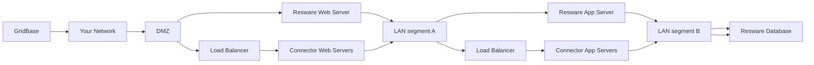

# Resware Connector Installation Guide

GridBase achieves its rich integration with Resware through its connector. This guide steps you through the process of
installing this Resware Connector in your organization's Resware environment.

# Recommended Tools

- A source code / text editor, such as Notepad++, Visual Studio Code, etc...

# System Requirements

- 2 Processor Cores or vCPUs minimum (4 or better recommended)
- 4GB RAM minimum (8GB or better recommended)
- Windows Server 2019 or later
    - Internet Information Systems (IIS)
    - Valid TLS/SSL certificates signed by a trusted Certificate Authority (CA) must be present and configured for
      Resware servers and Connector servers.
    - Resware Web Servers must support TLS 1.2, and configured to allow a cipher-chain supported by the version of
      Windows Server being used by the connector servers.
    - Connector servers must support TLS 1.2 and optionally higher versions as well. Earlier versions of TLS and SSL
      handshake protocols must be disabled.
    - HTTP Strict Transport Security (HSTS) headers must be configured on Connector servers.
    - Any public DNS records created for Connector servers should include CAA records to restrict TLS/SSL certificate
      issuance to approved Certificate Authorities.
- Microsoft SQL Server (MSSQL) 2019 or later
    - SQL Server Management Studio (SSMS)

# Planning

The infrastructure used to host Resware and this Connector should be designed to leverage layers of segmentation to
minimize web-facing attack surface. The required traffic patterns are as follows:

- The Connector Web Server must be able to receive inbound https requests from Resware's Web Server and
  GridBase (https://app.gridbase.io); and it must be able to make outbound https requests to Resware's Web Server,
  GridBase, Grafana, and AWS S3 resources.
- The Connector App Server must **only** receive inbound https requests from the Connector Web Server; and it must be
  able to make outbound requests to Resware's Web Server (https), the Connector's Web Server (https), and to the Resware
  database server (mssql).

## Simple

## High-Availability Configurations

The Resware Connector includes support for load balancers / reverse HTTP proxies, with no requirement for session
persistence / stickiness. The only recommendation in this setting is to include the original source IP address in the
X-Forwarded-For HTTP header in the load balancer's configuration. Additionally, it is strongly advised that this
header's value is included in web server (IIS) logs.

# Web Server Configuration

In Windows Server, open the Server Manager application and click **Add roles and features**. Click **Next** until you
reach the **Server Roles** screen, expand the **Web Server** role, and make sure the following options:

- Web Server
    - Common Http Features
        - Default Document
        - HTTP Errors
        - Static Content
    - Health and Diagnostics
        - HTTP Logging
    - Performance
        - Static Content Compression
    - Security
        - Request Filtering
    - Application Development
        - .NET Extensibility 4.7
        - Application Initialization
        - ISAPI Extensions
        - ISAPI Filters
- Management Tools
    - IIS Management Console

When done, click **Next** to progress to the **Features** screen, and make sure the following options are selected:

- .NET Framework 4.7 Features
    - .NET Framework 4.7
    - ASP.NET 4.7
    - WCF Services
        - HTTP Activation
        - TCP Port Sharing

When done updating these selections, finish the wizard steps to apply the changes. Note that this may require Internet
connectivity to complete.

# Database Setup

The Resware Connector for GridBase requires a database residing adjacent to the Resware database. This minimalist
database includes copies of Resware stored procedures it relies upon and some custom stored procedures as well. Your
organization's Database Administrators (DBAs) can freely review these stored procedures (and compare many against
standard Resware stored procedures) as needed.

## Database Login and User

### **BACKUP YOUR DATABASES!**

Before you begin installing or upgrading Resware or the Resware Connector, always take a full backup of existing Resware
and GridBase databases as a precaution before you begin.

The first step is to determine whether your configuration will use a SQL Login or a Windows Login to log in to the
database server to perform queries. Once the Login is configured in SQL Server, you will need to create the database and
add this login as a database user. This user will need permissions to:

- Execute stored procedures on the GridBase database **and** on the Resware database.
- Configure Resware database permissions as specified below...

### Resware Database Table Permissions

| Table Name                        | Select  | Insert  | Update  | Delete  |
|-----------------------------------|---------|---------|---------|---------|
| All Other Tables (*)              | &check; |         |         |         |
| BuyerSeller                       | &check; | &check; | &check; |         |
| ClosingDisclosureCommonSettlement | &check; | &check; |         |         |
| CommonSettlement                  | &check; | &check; | &check; |         |
| FileActionDocumentRel             | &check; | &check; |         |         |
| FileActionNoteRel                 | &check; | &check; | &check; |         |
| FileActions                       | &check; | &check; | &check; |         |
| FileMain                          | &check; |         | &check; |         |
| FilePartnerRemoteFile             | &check; | &check; |         |         |
| FinancialInfo                     | &check; | &check; | &check; |         |
| GeneralUser                       | &check; |         | &check; |         |
| PolicyCurative                    | &check; |         | &check; |         |
| PolicyCurativeDocumentRel         | &check; | &check; |         |         |
| PolicyCurativeNoteRel             | &check; | &check; |         |         |
| Signing                           | &check; | &check; | &check; | &check; |
| SigningDocumentRel                | &check; | &check; |         |         |
| SigningNotaryFeesRel              | &check; | &check; | &check; |         |
| SigningPartyRel                   | &check; | &check; | &check; | &check; |
| TitleReview                       | &check; |         | &check; |         |
| TitleReviewDocumentRel            | &check; | &check; |         |         |
| TitleReviewNoteRel                | &check; | &check; |         |         |
| UserRole                          | &check; | &check; |         |         |

## Install Stored Procedures

**IMPORTANT:** Do not apply/execute these scripts in the Resware database!

Before you begin, make sure any desired review of the stored procedures scripts has been completed by a Database
Administrator (DBA). If the Resware database is not named `Resware`, the DBA will need to update the stored procedures
to reference `YourReswareDatabaseName.dbo` instead of the default `Resware.dbo` resources.

Once review is complete, the DBA will need to apply/execute each of the stored procedure scripts (using a tool like SQL
Server Management Studio [SSMS]) included with this package in the `GridBase` database.

# App Server Installation

- Extract the contents of the gridbase-app-connector.zip file to the desired directory for the web site that will run on
  the app server.
- Copy the `AppServer_Web.config` file to the web site's root directory, rename it to `web.config`, and update its
  contents as follows:
    - Update the `ConnectorApiLogPath` to point to a directory where log files can be created by the IIS_USRS group.
      Make sure this resides in a drive with plenty of spare disk space, and make sure old logs files are periodically
      purged to maintain disk usage.
    - Update all instances of `[web-sever-fqdn]` text with the fully-qualified domain name (FQDN) configured for the
      connector's web server.
    - Update all instances of `[resware-fqdn]` text with the fully-qualified domain name (FQDN) of the Resware web
      server (where the Resware portal, WCF services, and REST APIs reside).
    - Update the remaining, empty values in the `appSettings` section with the values provided the GridBase team.
    - Update the `connectionStrings` section to point at your database server for both Resware and GridBase databases.
- Open IIS Manager on the app server...
- Expand the server on the left and click **Application Pools**.
    - Click **Add Application Pool** on the right. Enter a name of your choosing, set the **.NET CLR Version** to **.NET
      CLR Version 4.0...** and set the **Managed pipeline mode** to **Integrated**.
    - If you are using a Windows Login for the database user:
        - Select the Application Pool you just created, and click **Advanced Settings...** on the right.
        - Under the **Process Model** section, set the **Load User Profile** setting to **False**. Then click the *
          *[...]** button, select **Custom account**, click the **Set...** button, enter the credentials for the
          Windows/Active Directory user, click **OK** on all 3 dialogs to apply the changes.
- Expand the **Sites** folder on the left in IIS Manager
    - To add a new web site, right-click the **Sites** folder on the left and click **Add Website**
        - Set the site name as desired (typically the fully qualified domain name / FQDN).
        - Select the Application Pool created above.
        - Set the **Physical path** to the directory where you extracted the gridbase-app-connector.zip files.
        - Under binding, set the **Type** to **https**, set the IP Address and host name if/as needed (based on whether
          you wish to use SNI or a dedicated IP address for the SSL certificate).
        - Select the valid SSL certificate, and then click **OK** to start the site.
    - To configure an existing web site (such as the Default Web Site), select the web site on the left...
        - Click **Basic Settings...** on the right...
            - Select the Application Pool created above.
            - Set the **Physical path** to the directory where you extracted the gridbase-app-connector.zip files.
            - Click **OK**.
        - Click **Bindings...** on the right. If any bindings exist (other than the http binding for any (*) IP Address
          for the default web site created when IIS is installed), you may want to consider adding a new web site
          instead, as updating this configuration would replace any existing web site configured here.
            - Click **Add...**
            - Under binding, set the **Type** to **https**, set the IP Address and host name if/as needed (based on
              whether you wish to use SNI or a dedicated IP address for the SSL certificate).
            - Select the valid SSL certificate, and then click **OK**.
            - If any **http** bindings are configured, select and **Remove** them.
    - Navigate to the web site you configured in a web browser, and make sure you see the **GridBase Resware Connector (
      App)** page.

# Web Server Installation

- Extract the contents of the gridbase-web-connector.zip file to the desired directory for the web site that will run on
  the app server.
- Copy the `WebServer_Web.config` file to the web site's root directory, rename it to `web.config`, and update its
  contents as follows:
    - Update the `ConnectorApiLogPath` to point to a directory where log files can be created by the IIS_USRS group.
      Make sure this resides in a drive with plenty of spare disk space, and make sure old logs files are periodically
      purged to maintain disk usage.
    - Update the remaining, empty values in the `appSettings` section with the values provided the GridBase team.
    - Update all instances of `[app-sever-fqdn]` text with the fully-qualified domain name (FQDN) configured for the
      connector's app server.
- Open IIS Manager on the app server...
- Expand the server on the left and click **Application Pools**.
    - Click **Add Application Pool** on the right. Enter a name of your choosing, set the **.NET CLR Version** to **.NET
      CLR Version 4.0...** and set the **Managed pipeline mode** to **Integrated**.
    - Note that this application should always be configured to use Application Pool Identity (which is the default for
      IIS), as it should not be able to reach the database server directly.
- Expand the **Sites** folder on the left in IIS Manager
    - To add a new web site, right-click the **Sites** folder on the left and click **Add Website**
        - Set the site name as desired (typically the fully qualified domain name / FQDN).
        - Select the Application Pool created above.
        - Set the **Physical path** to the directory where you extracted the gridbase-app-connector.zip files.
        - Under binding, set the **Type** to **https**, set the IP Address and host name if/as needed (based on whether
          you wish to use SNI or a dedicated IP address for the SSL certificate).
        - Select the valid SSL certificate, and then click **OK** to start the site.
    - To configure an existing web site (such as the Default Web Site), select the web site on the left...
        - Click **Basic Settings...** on the right...
            - Select the Application Pool created above.
            - Set the **Physical path** to the directory where you extracted the gridbase-app-connector.zip files.
            - Click **OK**.
        - Click **Bindings...** on the right. If any bindings exist (other than the http binding for any (*) IP Address
          for the default web site created when IIS is installed), you may want to consider adding a new web site
          instead, as updating this configuration would replace any existing web site configured here.
            - Click **Add...**
            - Under binding, set the **Type** to **https**, set the IP Address and host name if/as needed (based on
              whether you wish to use SNI or a dedicated IP address for the SSL certificate).
            - Select the valid SSL certificate, and then click **OK**.
            - If any **http** bindings are configured, select and **Remove** them.
    - Navigate to the web site you configured in a web browser, and make sure you see the **GridBase Resware Connector (
      Web)** page. All services listed here should show a status of Up.
